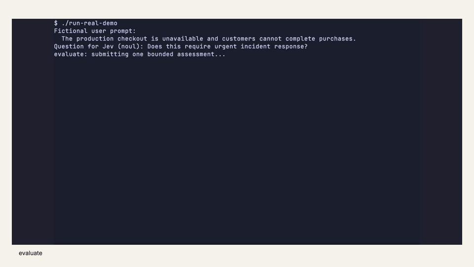

# Jev MCP

Local **MCP server** that gives a **Pi coding agent** (or any stdio MCP client you wire yourself) **typed evaluation** against **TypeSafe Jev** (`jev-1.13.0`): you supply evidence and bounded questions; Jev returns structured probabilities, not free-form generation.

**Experimental community client - not a TypeSafe product.** Offline regressions and a verified Pi-to-API path exist. Workflow quality, cost savings, and "the model will pick this tool" are **not** established. No installer, no self-update, no endpoint or model override.

<p align="center">
  <a href="https://github.com/resumocast/jev-mcp/releases/download/v0.1.0/jev-mcp-demo.mp4">
    
  </a>
</p>
<p align="center"><a href="https://github.com/resumocast/jev-mcp/releases/download/v0.1.0/jev-mcp-demo.mp4">Watch the 30-second terminal demo with narration</a></p>

## Typed primitives (`evaluate`)

| Type | Result |
| --- | --- |
| **noul** | Yes/no probability (optional `true`/`false` criteria text) |
| **choice** | Named option plus full distribution (1-255 options) |
| **score** | Probability-weighted position on 2-10 ordered levels (index from 0) |

Pass `state` (text, object, or array) and a `questions` map. Model is pinned; invalid or inconsistent API payloads fail closed. Example shape: [`examples/evaluate.json`](examples/evaluate.json).

```text
Pi chooses evaluate -> adapters/pi/jev.ts -> jev-mcp (Go, stdio) -> https://api.typesafe.ai/v1/systemone
```

Use for bounded semantic uncertainty only - not arithmetic, counting, dates, code generation, deterministic tests, authorization, or security sign-off. Confidence is not correctness.

## Pi quickstart

User-local only. **A TypeSafe account and Jev API key are required** for paid calls. Every `evaluate` (and paid selection) sends your `state` and `questions` to TypeSafe; Pi transcripts may also retain tool arguments and results. Never put the key on the CLI or in the environment.

### Recommended: release binary

1. Get `adapters/pi/jev.ts` from this repository (clone or download that file).
2. From the GitHub **v0.1.1** release, download the matching macOS binary and `SHA256SUMS`:
   - Apple Silicon: `jev-mcp-darwin-arm64`
   - Intel: `jev-mcp-darwin-amd64`
3. Verify checksum, install, and add the key:

```sh
# after downloading binary + SHA256SUMS into the current directory
shasum -a 256 -c SHA256SUMS --ignore-missing
ARCH=$(uname -m | sed 's/x86_64/amd64/')
mkdir -p ~/.local/bin ~/.pi/agent/extensions ~/.config/typesafe
cp jev-mcp-darwin-$ARCH ~/.local/bin/jev-mcp
chmod 755 ~/.local/bin/jev-mcp
cp /path/to/adapters/pi/jev.ts ~/.pi/agent/extensions/jev.ts
# sole contents: your TypeSafe Jev API key
chmod 600 ~/.config/typesafe/jev-pi.key
```

Ensure `~/.local/bin` is on `PATH`. Open a **new** Pi session, or run `/reload`. Do not overwrite `herdr-agent-state.ts`.

**Paths:** `~/.local/bin/jev-mcp`, `~/.pi/agent/extensions/jev.ts`, `~/.config/typesafe/jev-pi.key`. Overrides: absolute `JEV_MCP_BIN`, `JEV_MCP_KEY_FILE` only.

### Alternative: build from source

Needs the [Supported systems](#supported-systems-exact) toolchain (Go 1.27.1, Node >=22.19.0).

```sh
npm ci --ignore-scripts
make build
cp dist/jev-mcp-darwin-$(uname -m | sed 's/x86_64/amd64/') ~/.local/bin/jev-mcp
chmod 755 ~/.local/bin/jev-mcp
cp adapters/pi/jev.ts ~/.pi/agent/extensions/jev.ts
chmod 600 ~/.config/typesafe/jev-pi.key
```

Optional offline smoke (invalid calls only; no TypeSafe HTTP): `make test test-binary`.

### Remove

```sh
rm -f ~/.pi/agent/extensions/jev.ts ~/.local/bin/jev-mcp
# rm -f ~/.config/typesafe/jev-pi.key   # separate, intentional
```

## Supported systems (exact)

| Piece | Pin / observation |
| --- | --- |
| Go module | `go 1.26` minimum in `go.mod` |
| `make` / verification | **Go 1.27.1** (`GOTOOLCHAIN=local`) |
| Node | `>=22.19.0` |
| Pi test deps | `@earendil-works/pi-*` **0.85.1** |
| Pi runtime observed | **0.86.1** (lifecycle checks only; not a broad matrix) |
| Build outputs | `darwin/arm64`, `darwin/amd64` |
| Clients | Native **Pi** adapter tested; other MCP hosts need their own setup |
| Python | 3.9+ for export tooling only |

## Security and cost (short)

- Credential: mode **`0600`** regular file only; not env, not flags as secret values, not tool args.
- Network: **only** `https://api.typesafe.ai/v1/systemone` (charges possible). No OpenRouter, no proxy ambient config, no redirects.
- Bounds: ≤16 questions; 64 KiB request / 128 KiB response / 128 KiB MCP frame; 30s API deadline; ≤2 retries on 429/529 only.
- One in-flight evaluation per runner; stdout is MCP-only. Transcripts may retain args/results.

Full control list: [Safety and resource policy](#safety-and-resource-policy).

---

## Tool input detail

Each question needs `type`, `instructions`, and criteria as required:

| Type | Criteria |
| --- | --- |
| `noul` | Optional object with `true` and/or `false` strings |
| `choice` | Object map of option name → description or `null` |
| `score` | Array of level strings, low to high |

String rubrics only in v1. Nested JSON in state/instructions allowed within depth limits. Results include model, answers, usage; choice/score include confidence. Extra API fields are dropped; wrong types or bad distributions are errors.

## Experimental evidence selection

`--enable-selection` on the server exposes `select_evidence` (batch keep/drop via a fixed choice rubric). Default Pi adapter still exposes only `evaluate`. With `--jev-select-root <git-toplevel>` the adapter may also register `select_context` (allowlisted committed ranges only).

Selection is experimental: fixed `irrelevant` threshold 0.90 on float64 probabilities, no URL fetch, no arbitrary filesystem read, no codegen, no authorization. Preprocess **before** the main model reads the corpus or you do not save those tokens. Paid select mode needs a persisted Pi session and a small reservation budget (`--jev-select-budget`). Read mode is free of API/reservation. Limits (ranges, bytes, deadline) are enforced without silent truncation. Offline tests use Pi **0.85.1** deps; **0.86.1** had separate lifecycle checks - not proof of task value or savings.

## Safety and resource policy

- **CONTROL-1: Dedicated credential file.** Default `~/.config/typesafe/jev-pi.key`; `--key-file` absolute path only. Owned regular file, mode `0600`. Symlink final component, FIFO, bad content, oversized file rejected. Checks use the opened descriptor. Same-user processes and parent ACLs are not an isolation boundary.
- **CONTROL-2: Fixed network destination.** `https://api.typesafe.ai/v1/systemone` only.
- **CONTROL-3: Bounded work.** 16 questions max; 64 KiB / 128 KiB / 128 KiB caps; nesting depth 8. Resource limits, not token budgets. Oversize = error.
- **CONTROL-4: Deadlines and retries.** 30s wall clock; ≤2 retries for 429/529 only; ambiguous POST network failures not retried. Adapter has its own deadline and cleanup.
- **CONTROL-5: Process ownership.** No queue of concurrent evaluates; child env is `HOME` + fixed `PATH` + valid `LANG`; child reaped. Not a machine-wide spend cap. Git children for context collection are owned similarly.
- **CONTROL-6: Output boundaries.** Stdout = MCP messages only. Errors omit raw HTTP bodies and child diagnostics. Terminal text treated as untrusted.

Never put secrets in `state` or `questions`.

## Development and verification

```sh
npm ci --ignore-scripts
make test test-binary
```

`make test`: `gofmt` check, `go vet`, race tests, `tsc`, Pi tests, export tests. `make build`: trimmed darwin arm64/amd64 + `dist/SHA256SUMS`. `make test-binary`: real binary + adapter offline (invalid calls only; no TypeSafe HTTP).

### Source layout

| Path | Purpose |
| --- | --- |
| `cmd/jev-mcp/` | Stdio binary |
| `internal/mcp/` | JSON-RPC MCP transport |
| `internal/typesafe/` | Key file, HTTP client, validate |
| `internal/jsonfields/` | Canonical JSON field guards |
| `adapters/pi/jev.ts` | Pi extension (manual copy) |
| `tests/` | Offline Go/Pi/export/smoke tests |
| `examples/evaluate.json` | Schema sample, not workflow proof |
| `tools/export_public.py` | Allowlisted history-free export |
| `public-files.json` | Export allowlist |

## Maintainer notes: history-free snapshots

Synthetic fixtures only in-tree. Research data stays out. **Do not publish private product Git history** (no mirror push / visibility flip on a remote that still holds non-public commits). Public trees come from:

```sh
python3 tools/export_public.py /absolute/path/to/new-export --commit <reviewed-commit>
```

Allowlist + heuristic secret scan ≠ privacy guarantee; review contents. Export does not push or change remotes.

## Roadmap (compressed)

**Direction (unproven):** optional offload of routine judgments from expensive host models. Targets (not claims): simpler install, clearer multi-client support, measured net value.

**Done:** bounded MCP server, TypeSafe client, Pi adapter, offline regressions, MIT/NOTICE provenance, manual install paths, history-free export tool.

**Open:** ACTION-7 workflow value. Next increments stay narrow: one routine task (e.g. evidence batching), measure quality/cost honestly, then other harnesses, then any installer - only after value. No automatic model routing, universal tool interception, or alternate providers in scope.

## Provenance and references

Derived from [itsmostafa/typesafe-mcp](https://github.com/itsmostafa/typesafe-mcp) `0c9f35d9b1859189fc7e7d01947061f311ca6dde` (v0.4.1); client/transport/adapter rewritten for the boundaries above. See [`LICENSE`](LICENSE) and [`NOTICE`](NOTICE).

- [TypeSafe API](https://docs.typesafe.ai/api.md)
- [Models and limits](https://docs.typesafe.ai/models.md)
- [Structured state](https://docs.typesafe.ai/concepts/state.md)
- [Score levels](https://docs.typesafe.ai/primitives/score.md)
- [Confidence](https://docs.typesafe.ai/confidence.md)
- [Jev limitations](https://docs.typesafe.ai/model-jaggedness/jev-1.13.md)
